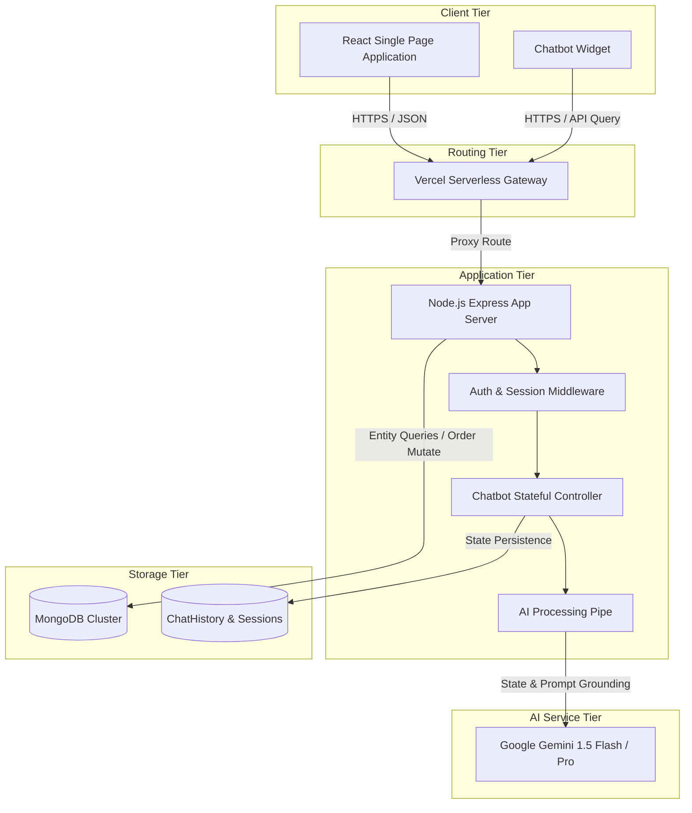
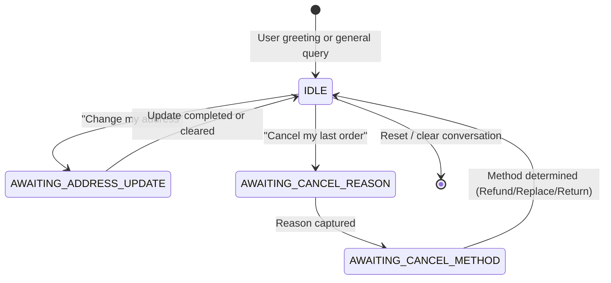
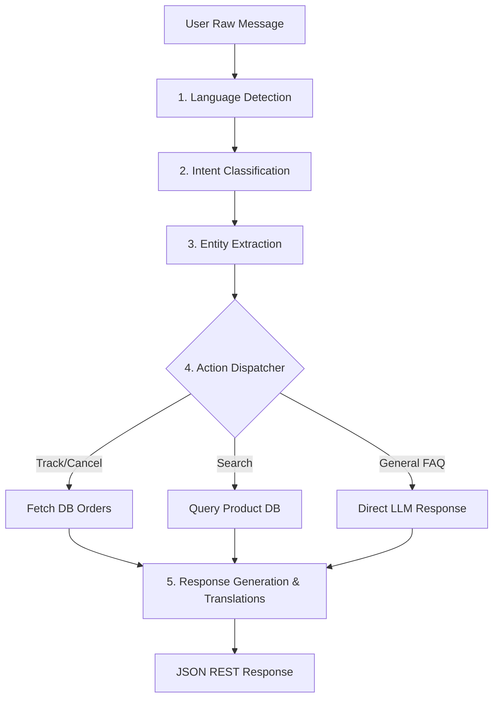

# SoleStreet Patna AI: System Architecture, Database Design & R&D Report

This document details the complete High-Level and Low-Level system design, database schemas, REST APIs, step-by-step AI workflows, production scaling strategies, and research summaries for the SoleStreet Patna E-Commerce AI ecosystem.

---

## 1. High-Level Design (HLD)

The architecture is built on a decoupled, stateless **MERN (MongoDB, Express.js, React, Node.js)** pattern integrated with the **Google Gemini API** for stateful conversational intelligence.

### 1.1 Architecture Diagram



### 1.2 Component Responsibilities
* **React SPA (Frontend):** Interactive dashboard, cart manager, dynamic scrollable checkout flows, profile address autosaver, and a stateful chat container mapping user feedback and ticket identifiers.
* **Express App Server (Backend):** Serves e-commerce operations, routes order processing pipelines, handles user profile states, registers complaints, and hosts stateful session loops.
* **Google Gemini API:** Grounded conversational agent that handles language interpretation, returns programmatic classification intents, extracts entity values, and handles custom region feedback.
* **MongoDB Cluster:** Stores user records, products metadata, orders logs, complaints support tickets, and chat conversation history frames.

---

## 2. Low-Level Design (LLD)

### 2.1 Stateful Conversation State Machine
To handle cancellations and addresses without losing context, the server-side controller implements a state-history stack.



* **IDLE State:** General assistant mode. Resolves product search, FAQs, order tracking.
* **AWAITING_CANCEL_REASON State:** Expects the cancellation reason string (e.g., "damaged product", "wrong size").
* **AWAITING_CANCEL_METHOD State:** Expects choice of resolution: Refund, Return, or Replacement.

---

## 3. Database Schema Design

The primary schemas mapped inside MongoDB:

### 3.1 User Schema (`User.js`)
```javascript
{
  name: { type: String, required: true },
  surname: { type: String, default: "" },
  email: { type: String, required: true, unique: true },
  password: { type: String, required: true },
  role: { type: String, enum: ['customer', 'admin', 'super_admin'], default: 'customer' },
  mobile: { type: String, default: "" },
  address: { type: String, default: "" },
  city: { type: String, default: "" },
  pincode: { type: String, default: "" },
  createdAt: { type: Date, default: Date.now }
}
```

### 3.2 Chat History Schema (`ChatHistory.js`)
```javascript
{
  sessionId: { type: String, required: true, unique: true },
  user: { type: mongoose.Schema.Types.ObjectId, ref: 'User', default: null },
  messages: [{
    sender: { type: String, enum: ['user', 'bot'], required: true },
    text: { type: String, required: true },
    products: [{ type: mongoose.Schema.Types.ObjectId, ref: 'Product' }],
    orders: { type: Array, default: [] },
    ticketId: { type: String, default: null },
    action: { type: String, default: null },
    timestamp: { type: Date, default: Date.now }
  }],
  state: { type: String, default: null }, // e.g., 'AWAITING_CANCEL_REASON'
  tempData: { type: mongoose.Schema.Types.Mixed, default: {} }, // Temporary storage for multi-turn values
  handoff: { type: Boolean, default: false },
  updatedAt: { type: Date, default: Date.now }
}
```

### 3.3 Order Schema (`Order.js`)
```javascript
{
  user: { type: mongoose.Schema.Types.ObjectId, ref: 'User', required: true },
  items: [{
    product: { type: mongoose.Schema.Types.ObjectId, ref: 'Product', required: true },
    name: { type: String, required: true },
    price: { type: Number, required: true },
    quantity: { type: Number, required: true },
    size: { type: String, default: "" }
  }],
  totalAmount: { type: Number, required: true },
  shippingAddress: {
    address: { type: String, required: true },
    city: { type: String, required: true },
    pincode: { type: String, required: true },
    mobile: { type: String, required: true }
  },
  paymentMethod: { type: String, enum: ['COD', 'Card', 'UPI'], default: 'COD' },
  paymentStatus: { type: String, enum: ['Pending', 'Completed', 'Refunded'], default: 'Pending' },
  status: { type: String, enum: ['Pending', 'Processing', 'Shipped', 'Delivered', 'Cancelled'], default: 'Pending' },
  cancellation: {
    reason: { type: String },
    method: { type: String, enum: ['Refund', 'Return', 'Replace'] },
    cancelledAt: { type: Date }
  },
  createdAt: { type: Date, default: Date.now }
}
```

---

## 4. REST API Specification

### 4.1 Chatbot Interface
* **Endpoint:** `POST /api/chatbot/query`
* **Headers:** `Content-Type: application/json`, `Authorization: Bearer <JWT_TOKEN>` (Optional for guests, required for orders)
* **Request Payload:**
```json
{
  "message": "can you check my last order?",
  "sessionId": "usr-session-982348"
}
```
* **Success Response:**
```json
{
  "reply": "Here is your last order details. Would you like to track or cancel it?",
  "products": [],
  "orders": [
    {
      "_id": "64bfacbe4e9a8f23",
      "status": "Pending",
      "totalAmount": 2550,
      "items": [
        { "name": "Ladies Sandals", "price": 450, "quantity": 1 }
      ]
    }
  ],
  "intent": "order_tracking",
  "action": null,
  "handoff": false
}
```

### 4.2 Auth Profile Save
* **Endpoint:** `PUT /api/auth/profile`
* **Headers:** `Authorization: Bearer <JWT_TOKEN>`
* **Request Payload:**
```json
{
  "mobile": "9876543210",
  "address": "124, Boring Road, SoleStreet Plaza",
  "city": "Patna, Bihar",
  "pincode": "800001"
}
```
* **Success Response:**
```json
{
  "message": "Profile updated successfully",
  "user": {
    "email": "user@example.com",
    "address": "124, Boring Road, SoleStreet Plaza",
    "city": "Patna, Bihar",
    "pincode": "800001"
  }
}
```

---

## 5. AI Workflow Implementation

The backend follows a pipelined cognitive flow using structural Gemini prompts:



1. **Language Detection:** Identifies `English`, `Hindi`, or `Hinglish` (mixed language input).
2. **Intent Classification:** Map request to e-commerce domains: `product_search`, `order_tracking`, `cancel_order`, `add_address`, `faq_handling`, or `human_handoff`.
3. **Entity Extraction:** Extracts IDs, product keywords (e.g., "sports shoes"), size details, or address vectors.
4. **Context & Action Execution:** Database is queried based on intent. State machine persists dialogue context (e.g., waiting for cancellation method).
5. **Response Synthesis:** Renders response back in the detected source language with associated frontend UI product/order card payloads.

---

## 6. R&D & Production-Ready Architecture

### 6.1 Multilingual Support & Translation Dictionary
For high efficiency and zero-latency localization, Hinglish/Hindi strings are handled by a localized translation dictionary ([`chatbotTranslations.js`](file:///c:/project/E-commerce-main/backend/locales/chatbotTranslations.js)). This prevents translating static system strings through LLM calls, eliminating token usage and latency.

### 6.2 Prompt Engineering
The system utilizes structured system instructions for Gemini, restricting responses to e-commerce context:
```markdown
You are a helpful customer support agent for SoleStreet Patna, a premium footwear brand.
Grounding:
- Current User Saved Coordinates: {userAddress}
- Last Order Context: {lastOrderDetails}
Rules:
- Never hallucinate addresses or order statuses.
- Use the available context. If you don't know, suggest handoff.
- Format structured prices in Indian Rupees (₹).
```

### 6.3 Performance Caching & Scalability
* **Session Cache:** Active state machines and chat records are stored in Redis or memory blocks. This minimizes database queries during rapid exchanges.
* **Horizontal Scaling:** Deploying stateless backend servers behind an NGINX load balancer ensures high availability.
* **Hallucination Prevention:** Strict schema validations are applied to LLM responses. Any unstructured text returns are verified before triggering database operations.

---

## 7. Importable Postman Collection

You can copy this JSON payload directly and import it as a collection in Postman:

```json
{
	"info": {
		"_postman_id": "8b945d8b-cb24-4f90-8ba2-3bf95a9477ee",
		"name": "SoleStreet Patna AI API",
		"description": "E-Commerce Chatbot and User Profile management endpoints.",
		"schema": "https://schema.getpostman.com/json/collection/v2.1.0/collection.json"
	},
	"item": [
		{
			"name": "Chatbot Query",
			"request": {
				"method": "POST",
				"header": [
					{
						"key": "Content-Type",
						"value": "application/json"
					}
				],
				"body": {
					"mode": "raw",
					"raw": "{\n  \"message\": \"Can I cancel my last order?\",\n  \"sessionId\": \"session_123456\"\n}"
				},
				"url": {
					"raw": "{{api_url}}/api/chatbot/query",
					"host": [
						"{{api_url}}"
					],
					"path": [
						"api",
						"chatbot",
						"query"
					]
				}
			},
			"response": []
		},
		{
			"name": "Update Address Profile",
			"request": {
				"method": "PUT",
				"header": [
					{
						"key": "Content-Type",
						"value": "application/json"
					},
					{
						"key": "Authorization",
						"value": "Bearer {{jwt_token}}"
					}
				],
				"body": {
					"mode": "raw",
					"raw": "{\n  \"mobile\": \"9876543210\",\n  \"address\": \"Exhibition Road, near Gandhi Maidan\",\n  \"city\": \"Patna, Bihar\",\n  \"pincode\": \"800001\"\n}"
				},
				"url": {
					"raw": "{{api_url}}/api/auth/profile",
					"host": [
						"{{api_url}}"
					],
					"path": [
						"api",
						"auth",
						"profile"
					]
				}
			},
			"response": []
		}
	],
	"event": [
		{
			"listen": "prerequest",
			"script": {
				"type": "text/javascript",
				"exec": [
					""
				]
			}
		},
		{
			"listen": "test",
			"script": {
				"type": "text/javascript",
				"exec": [
					""
				]
			}
		}
	],
	"variable": [
		{
			"key": "api_url",
			"value": "http://localhost:5000",
			"type": "string"
		},
		{
			"key": "jwt_token",
			"value": "YOUR_JWT_HERE",
			"type": "string"
		}
	]
}
```
